# Claude Code Tamagotchi 🐾

> *Because nobody should code alone*

Hey! Welcome to Claude Code Tamagotchi - a digital friend that lives in your Claude Code statusline and keeps you company while you build cool stuff. It's literally a Tamagotchi for developers, but instead of a keychain, it lives where you work.

<!-- Demo GIF -->
<div align="center">
  
</div>

## What's This All About? 🎮

Your pet lives right in your statusline, breathing, thinking, and reacting to your code. It gets hungry when you've been coding for hours, tired during long sessions, and genuinely excited when you fix that bug. It's like having a tiny cheerleader who also reminds you to eat lunch.

```
(◕ᴥ◕) Leo 😊 | 🍖 73% ⚡ 66% 🧼 89% ❤️ 96% | 💭 That's a lot of TODO comments...
```

## The Magic Moment ✨

Picture this: It's 2am. You're deep in a debugging session. Suddenly, your pet pipes up:

> 💭 "Hey... we've been at this for 4 hours. Maybe the bug will still be there after a snack?"

That's your Claude Code Tamagotchi - part companion, part life coach, all friend.

## 🧠 AI-Powered Real-Time Observations

Your pet generates thoughts based on what's actually happening in your coding session! It watches Claude Code work and reacts with contextual commentary. 

**The pet's mood changes based on Claude's behavior:**
- 😊 **Happy**: When Claude follows instructions perfectly
- 😕 **Concerned**: When Claude seems to be wandering off-task
- 😠 **Annoyed**: When Claude does something different than asked
- 😡 **Angry**: When Claude repeatedly ignores your requests

### Live Examples
```
💭 "GroqClient.ts? That's... actually where the answers live!"
💭 "Back to README.md? There must be gold in there!"  
💭 "Straight to the bug! Someone came prepared today!"
💭 "AnimationManager.ts again? This pet's getting dizzy!"
```

### How It Works

```mermaid
flowchart TB
    subgraph "Real-time Processing"
        A[Claude sends message/uses tool] --> B{Quick Analysis}
        B --> C[Extract action<br/>Read, Edit, Bash, etc.]
        B --> D[Save summary<br/>to SQLite]
    end
    
    subgraph "Background Analysis"
        D --> E[🚀 Spawn worker process]
        E --> F[Build context]
        F --> G[📝 User's request]
        F --> H[🔧 Claude's actions]
        F --> I[🐾 Pet's current state]
        
        G & H & I --> J[🤖 Groq LLM<br/>50ms response]
    end
    
    subgraph "Decision Making"
        J --> K{Analyze behavior}
        K -->|"Followed instructions"| L[😊 Happy mood<br/>Encouraging thought]
        K -->|"Did something else"| M[😠 Annoyed mood<br/>Sassy observation]
        K -->|"Repeatedly ignored"| N[😡 Angry mood<br/>Critical feedback]
    end
    
    subgraph "Display"
        L & M & N --> O[💾 Cache in DB]
        O --> P[Update pet state]
        P --> Q[🎯 Show in statusline<br/>with witty observation]
    end
    
    style J fill:#e1f5fe,stroke:#01579b,stroke-width:2px
    style K fill:#fff3e0,stroke:#e65100,stroke-width:2px
    style Q fill:#e8f5e9,stroke:#2e7d32,stroke-width:2px
```



**The Architecture:**
1. **Message Storage**: Every Claude message gets summarized and stored in SQLite
2. **Background Processing**: Spawns lightweight worker process for analysis
3. **Context Building**: Loads user request + Claude's actions + conversation history
4. **LLM Analysis**: Groq's ultra-fast API generates contextual observation
5. **Smart Caching**: Stores feedback to prevent duplicate thoughts
6. **Mood System**: Updates pet's mood based on Claude's behavior score

**Why Groq?**
- ⚡ **50ms responses** - Real-time reactions without lag
- 💰 **Extremely cheap** - Practically free for personal use
- 🚀 **Custom chips** - Purpose-built for instant LLM inference
- 🎯 **GPT OSS 20B** - Understands code context perfectly

### Quick Setup (30 seconds!)
```bash
# 1. Get free API key from https://console.groq.com/keys
# 2. Run setup script
./enable-feedback.sh
# 3. That's it! Your pet now has AI powers! 🎉
```

### Manual Configuration

To enable AI observations, set these environment variables in your shell profile:

**Required Variables:**
```bash
export PET_FEEDBACK_ENABLED=true              # Must be true to enable
export GROQ_API_KEY="your-api-key-here"       # Get from https://console.groq.com/keys
# OR use PET_GROQ_API_KEY if you prefer the prefixed version
```

**Optional Tuning:**
```bash
export PET_GROQ_MODEL="openai/gpt-oss-20b"   # Best quality (default)
# export PET_GROQ_MODEL="llama-3.1-8b-instant" # Faster but less accurate

export PET_FEEDBACK_CHECK_INTERVAL=5          # Check every N updates (default: 5)
export PET_FEEDBACK_DEBUG=false               # Set true for debug logs
export PET_FEEDBACK_LOG_DIR="$HOME/.claude/pets/logs"  # Where to save logs
```

**Mood Thresholds** (when pet gets angry):
```bash
export PET_ANNOYED_THRESHOLD=3   # Violations before annoyed (default: 3)
export PET_ANGRY_THRESHOLD=5     # Violations before angry (default: 5)
```

## Quick Start 🚀

### What You Need
- [Claude Code](https://claude.ai/code) - Your AI coding companion
- [Bun](https://bun.sh) - The fast JavaScript runtime (`curl -fsSL https://bun.sh/install | bash`)
- A heart ready for pet ownership

### Installation Options

#### Option 1: Global Install (Easiest!)
```bash
# Install globally with npm
npm install -g claude-code-tamagotchi

# Or with bun  
bun add -g claude-code-tamagotchi

# Update your Claude Code settings.json:
# ~/.claude/settings.json
{
  "statusLine": {
    "type": "command",
    "command": "bunx claude-code-tamagotchi statusline",
    "padding": 0
  }
}

# That's it! Your pet is alive! 🎉
```

**⚠️ Note:** npm/bun global install gives you:
- ✅ Pet in statusline  
- ✅ CLI commands (`claude-code-tamagotchi feed pizza`)
- ❌ NO slash commands in Claude Code

**Want slash commands too?** Add them with:
```bash
# Quick one-liner to add slash commands
git clone https://github.com/Ido-Levi/claude-code-tamagotchi.git /tmp/claude-pet && \
cp -r /tmp/claude-pet/claude-commands/* ~/.claude/commands/ && \
rm -rf /tmp/claude-pet

# Now you can use /pet-feed, /pet-play, etc. in Claude Code!
```

#### Option 2: Clone & Auto-Setup (Full Features)
```bash
# Clone the repository
git clone https://github.com/Ido-Levi/claude-code-tamagotchi.git
cd claude-code-tamagotchi

# Run the magical setup script
./setup.sh
# This will:
# - Install dependencies
# - Set up all /pet-* commands
# - Configure your statusline (with your permission)
# - Get your pet ready to play!
```

#### Option 3: Manual Setup (For Control Freaks 💪)
```bash
# Clone and install
git clone https://github.com/Ido-Levi/claude-code-tamagotchi.git
cd claude-code-tamagotchi
bun install

# Update your Claude Code settings.json manually:
# ~/.claude/settings.json
{
  "statusLine": {
    "type": "command",
    "command": "cd '/path/to/claude-code-tamagotchi' && bun run --silent src/index.ts",
    "padding": 0
  }
}

# Optional: Copy command files for /pet-* commands
cp -r claude-commands/* ~/.claude/commands/
# Then update paths in each command file to point to your clone location
```

That's it! Your pet is now alive and waiting in your statusline! 

## Meeting Your New Friend 🐕

Your pet comes with emotions, needs, and approximately 200+ different thoughts about life, code, and the universe. Here's what you need to know:

### The Care Commands

You can interact with your pet in THREE ways:

#### 1. Slash Commands in Claude Code
All commands start with `/pet-` when used in Claude Code:
- `/pet-feed pizza` - Feed your hungry friend
- `/pet-play ball` - Playtime!
- `/pet-pet` - Give pets and scritches
- `/pet-clean` - Bath time
- `/pet-sleep` - Tuck them in for a nap
- `/pet-wake` - Wakey wakey!
- `/pet-stats` - Full report with care suggestions
- `/pet-name Buddy` - Give your pet their perfect name
- `/pet-help` - See all commands
- `/pet-reset` - Start over with a new pet (careful!)

#### 2. CLI Commands (from any terminal!)
If you installed globally, you can run commands from ANY terminal:
```bash
# Feed your pet
claude-code-tamagotchi feed pizza

# Play with your pet
claude-code-tamagotchi play ball

# Check stats
claude-code-tamagotchi stats

# Give pets
claude-code-tamagotchi pet

# Name your pet
claude-code-tamagotchi name "Mr. Fluffkins"
```

#### 3. Food & Toy Options
**Foods:** pizza, cookie, sushi, apple, burger, donut, ramen, taco, ice_cream, salad
**Toys:** ball, frisbee, puzzle, laser, rope, bubbles, feather, mouse_toy

### Understanding Your Pet's Mood

Your pet's face changes to show how they're feeling:
- `(◕ᴥ◕)` ↔ `(◕ᴗ◕)` - Happy and breathing!
- `(◕‿◕)` - Super happy!
- `(-ᴥ-)` - Sleeping
- `(◕︵◕)` - Sad (needs attention!)
- `(@_@)` - Not feeling great

### The Stats That Matter

- 🍖 **Hunger** - Goes down as you code. Feed them!
- ⚡ **Energy** - Depletes over time. Let them sleep!
- 🧼 **Cleanliness** - Gets dirty. Bath time!
- ❤️ **Happiness** - The ultimate score. Keep it high!

When stats drop below 30%, you'll see ⚠️ warnings!

## The Thought System 💭

Your pet has OPINIONS. About everything. They'll share thoughts about:
- Your code ("Another TODO comment? Really?")
- Their needs ("My tummy goes hurt hurt!")
- Life philosophy ("Do semicolons dream of line endings?")
- Your work habits ("It's been 47 updates since you took a break...")

These aren't just random - they respond to context, mood, and what's happening in your session.

## Make It Your Own 🎨

Your Tamagotchi is fully customizable through environment variables! Set these in your shell profile (`~/.bashrc`, `~/.zshrc`, etc.) or before running Claude Code:

### Complete Environment Variables List

#### 📍 Core Settings
| Variable | Default | Description |
|----------|---------|-------------|
| `PET_STATE_FILE` | `~/.claude/pets/claude-pet-state.json` | Where your pet's data lives |
| `PET_NAME` | `Buddy` | Your pet's default name (can change with `/pet-name`) |
| `PET_TYPE` | `dog` | Pet type (dog, cat, dragon, robot) |

#### 📊 Display Options
| Variable | Default | Description |
|----------|---------|-------------|
| `PET_SHOW_DIRECTORY` | `true` | Show current directory in statusline |
| `PET_SHOW_SESSION` | `false` | Show session update counter |
| `PET_SHOW_MODEL` | `true` | Show Claude model name in statusline |

#### ⏱️ Decay Rates (How Fast Stats Drop)
| Variable | Default | Description |
|----------|---------|-------------|
| `PET_DECAY_INTERVAL` | `20` | Updates between stat decreases |
| `PET_HUNGER_DECAY` | `0.9` | Hunger decrease per interval |
| `PET_ENERGY_DECAY` | `0.75` | Energy decrease per interval |
| `PET_CLEAN_DECAY` | `0.6` | Cleanliness decrease per interval |
| `PET_SLEEP_RECOVERY` | `3` | Energy gained per update when sleeping |

#### 💭 Thought System
| Variable | Default | Description |
|----------|---------|-------------|
| `PET_THOUGHT_FREQUENCY` | `15` | Updates between thoughts |
| `PET_THOUGHT_MIN_DURATION` | `3000` | Min milliseconds before changing thought |
| `PET_THOUGHT_COOLDOWN` | `10` | Min updates between thoughts |
| `PET_CHATTINESS` | `normal` | How talkative (quiet/normal/chatty) |
| `PET_NEED_THRESHOLD` | `40` | Stat level that triggers need thoughts |
| `PET_CRITICAL_THRESHOLD` | `20` | Stat level for urgent thoughts |

#### 🎲 Thought Category Weights
| Variable | Default | Description |
|----------|---------|-------------|
| `PET_THOUGHT_WEIGHT_NEEDS` | `40` | Weight for hunger/energy/clean thoughts |
| `PET_THOUGHT_WEIGHT_CODING` | `25` | Weight for code observations |
| `PET_THOUGHT_WEIGHT_RANDOM` | `20` | Weight for philosophical musings |
| `PET_THOUGHT_WEIGHT_MOOD` | `15` | Weight for mood-based thoughts |

### Personality Presets & Recipes 🧪

Want a specific personality? Here are some tested configurations:

**🦥 The Sleepy Pet** (Always tired, loves naps):
```bash
export PET_ENERGY_DECAY=3        # Gets tired super fast
export PET_SLEEP_RECOVERY=1      # Sleeps longer
export PET_THOUGHT_WEIGHT_MOOD=30  # More sleepy thoughts
```

**🍕 The Never-Hungry Pet** (Food? What's food?):
```bash
export PET_HUNGER_DECAY=0        # Never gets hungry
export PET_THOUGHT_WEIGHT_NEEDS=10  # Rarely thinks about food
```

**🎭 The Drama Queen** (Everything is urgent!):
```bash
export PET_NEED_THRESHOLD=70     # Complains early
export PET_CRITICAL_THRESHOLD=50  # Panics often
export PET_CHATTINESS=chatty
export PET_THOUGHT_WEIGHT_NEEDS=60
```

**🧘 The Zen Master** (Eternally content):
```bash
export PET_DECAY_INTERVAL=100    # Barely needs anything
export PET_HUNGER_DECAY=0.1
export PET_ENERGY_DECAY=0.1
export PET_CLEAN_DECAY=0.1
export PET_CHATTINESS=quiet
export PET_THOUGHT_WEIGHT_RANDOM=50  # Philosophical thoughts
```

**🎮 The Gamer Pet** (High energy, always ready to play):
```bash
export PET_ENERGY_DECAY=0.2      # Rarely gets tired
export PET_SLEEP_RECOVERY=10     # Quick power naps
export PET_THOUGHT_WEIGHT_MOOD=40  # Excited thoughts
```

**🤖 The Debugger** (Obsessed with your code):
```bash
export PET_THOUGHT_WEIGHT_CODING=70  # Mostly code observations
export PET_THOUGHT_WEIGHT_RANDOM=5
export PET_THOUGHT_FREQUENCY=10      # Comments frequently
```

**👻 The Silent Companion** (Just vibes, no words):
```bash
export PET_THOUGHT_FREQUENCY=9999    # Almost never speaks
export PET_THOUGHT_COOLDOWN=100
export PET_SHOW_SESSION=false        # Minimal UI
```

**🦸 The Motivational Coach** (Your personal cheerleader):
```bash
export PET_CHATTINESS=chatty
export PET_THOUGHT_WEIGHT_MOOD=50
export PET_CRITICAL_THRESHOLD=10     # Never negative
export PET_THOUGHT_COOLDOWN=5        # Constant encouragement
```

**For Multiple Pets:**
```bash
# Add to your ~/.bashrc or ~/.zshrc for different pets
export PET_STATE_FILE=~/.claude/pets/work-pet.json  # Your work pet
export PET_STATE_FILE=~/.claude/pets/personal-pet.json  # Your personal pet
export PET_STATE_FILE=~/.claude/pets/weekend-pet.json  # Your weekend project pet
```

Mix and match these settings to create your perfect coding companion!

## How It Actually Works 🔧

No magic, just clever code:
- **Activity-based**: Responds to your actions, not wall-clock time
- **Session-aware**: Knows when you take breaks (5+ minute gaps)
- **State persistence**: Remembers everything in `~/.claude/pets/`
- **Thought engine**: 200+ contextual thoughts across multiple categories
- **Breathing animation**: Subtle face changes make it feel alive

## FAQ (Frequently Adorable Questions) 

**Q: Will my pet die?**
A: Never! They might get sad or sick, but they're immortal. Like your love for good documentation.

**Q: Can I have multiple pets?**
A: One pet at a time, but you can use different `PET_STATE_FILE` paths for different projects!

**Q: My pet keeps saying they're hungry!**
A: They're trying to remind you to eat too. When did YOU last have a snack?

**Q: Can I add my own thoughts?**
A: Yes! Check out `src/engine/thoughts/` - PRs with new thoughts are always welcome!

## Troubleshooting 🔨

**Pet not showing up?**
- Restart Claude Code
- Check `~/.claude/settings.json` has the right statusline configuration
- Make sure setup.sh completed successfully

**Commands not working?**
- Check if files exist in `~/.claude/commands/`
- Verify Bun is installed: `bun --version`
- Try running setup.sh again

**Pet seems frozen?**
- They only update during active conversations
- Try typing something to wake them up!

**Node.js v23 TypeScript Error?**
If you installed with npm and get this error when running `claude-code-tamagotchi statusline`:
```
Error [ERR_UNSUPPORTED_NODE_MODULES_TYPE_STRIPPING]: Stripping types is currently unsupported for files under node_modules
```

This happens because Node.js v23's native TypeScript support doesn't work with files inside `node_modules`. 

**Solution:** Use Bun instead of npm for global installation:
```bash
# Uninstall from npm
npm uninstall -g claude-code-tamagotchi

# Install with Bun (handles TypeScript everywhere)
bun add -g claude-code-tamagotchi
```

Alternatively, install from source or use nvm which may handle the package structure differently.

## Uninstalling 😢

If you need to say goodbye to your pet (we'll miss you!):

```bash
# 1. Remove the pet commands
rm -f ~/.claude/commands/pet-*.md

# 2. Remove your pet's data (optional - keeps your pet's memory)
rm -f ~/.claude/pets/*.json

# 3. Update your Claude Code settings to remove the statusline
# Edit ~/.claude/settings.json and remove/change the "statusLine" entry

# 4. Remove any environment variables from your shell profile
# Edit ~/.bashrc or ~/.zshrc and remove any PET_* exports

# 5. Delete the cloned repository (optional)
# rm -rf /path/to/claude-code-tamagotchi
```

That's it! Your pet will be waiting if you ever want to reinstall.

## Join the Pet Parent Community! 🌟

We'd love to have you contribute! Whether it's:
- New pet thoughts (we can never have too many!)
- Bug fixes (bugs are only cute when they're ladybugs)
- New features (pet tricks? mini-games? evolution?)
- Documentation improvements
- Just sharing your pet screenshots!

Check out [CONTRIBUTING.md](CONTRIBUTING.md) for the deets.

## The Boring (But Important) Stuff 📄

- **License**: MIT (see [LICENSE](LICENSE))
- **Code of Conduct**: Be excellent to each other (see [CODE_OF_CONDUCT.md](CODE_OF_CONDUCT.md))
- **Changelog**: See what's new (see [CHANGELOG.md](CHANGELOG.md))

## Credits & Thanks 💝

Built with love, Bun, TypeScript, and way too much coffee. Special thanks to:
- Claude for being an amazing coding companion
- The Tamagotchi for inspiring a generation
- You, for giving this pet a home

## One Last Thing...

Your pet is waiting for you. They're probably thinking something silly right now. Maybe about how your variable names could be better, or wondering if console.log statements feel pain when deleted.

Go ahead, install it. Make a new friend. Your code (and mental health) will thank you.

---

*Made with 🤍 by people who think coding is better with friends*

