# Claude Code Tamagotchi 🐾

> *Real-time behavioral enforcement for Claude Code, disguised as a virtual pet*

**🚨 EXPERIMENTAL FEATURE: BEHAVIORAL ENFORCEMENT SYSTEM 🚨**

**This pet now includes an experimental behavioral enforcement system that monitors Claude's actions in real-time and can block operations that violate your instructions. Think of it as a safety net that ensures Claude stays on track with what you actually asked for. This feature is in active development and may occasionally flag legitimate operations - we're tuning it based on real-world usage.**

**📢 Help Us Make This Amazing:** If you encounter false positives (legitimate actions blocked), please [open an issue](https://github.com/Ido-Levi/claude-code-tamagotchi/issues)! Your feedback is crucial for refining this feature. Include:
- What Claude was trying to do
- What you actually asked for  
- The violation message

Every report helps us make the violation detection smarter and more accurate

## Table of Contents

- [What's This All About?](#whats-this-all-about-)
- [Quick Start](#quick-start-)
- [Installation Options](#installation-options)
- [AI-Powered Behavioral Monitoring](#ai-powered-behavioral-monitoring-)
- [Commands & Interaction](#commands--interaction)
- [Understanding Your Pet](#understanding-your-pet)
- [The Thought System](#the-thought-system-)
- [Configuration](#configuration)
- [FAQ](#faq-frequently-adorable-questions)
- [Troubleshooting](#troubleshooting)
- [Contributing](#join-the-pet-parent-community-)

## What's This All About? 🎮

Hey! Welcome to Claude Code Tamagotchi - a digital friend that lives in your Claude Code statusline and keeps you company while you build cool stuff. It's literally a Tamagotchi for developers, but instead of a keychain, it lives where you work.

But here's the twist: this isn't just a virtual pet. It's a real-time behavioral enforcement system that monitors Claude Code's actions, detects when it's going off-track, and can actually interrupt operations that violate your instructions. The pet is the friendly face of a sophisticated AI accountability system.

<!-- Demo GIF -->
<div align="center">
  
</div>

Your pet lives right in your statusline, breathing, thinking, and reacting to your code. It gets hungry when you've been coding for hours, tired during long sessions, and genuinely excited when you fix that bug. It's like having a tiny cheerleader who also reminds you to eat lunch - and now it also makes sure Claude stays on track with what you actually asked for.

```
(◕ᴥ◕) Leo 😊 | 🍖 73% ⚡ 66% 🧼 89% ❤️ 96% | 💭 That's a lot of TODO comments...
```

Picture this: It's 2am. You're deep in a debugging session. Suddenly, your pet pipes up:

> 💭 "Hey... we've been at this for 4 hours. Maybe the bug will still be there after a snack?"

That's your Claude Code Tamagotchi - part companion, part life coach, all friend.

## Quick Start 🚀

### What You Need
- [Claude Code](https://claude.ai/code) - Your AI coding companion
- [Bun](https://bun.sh) - The fast JavaScript runtime (`curl -fsSL https://bun.sh/install | bash`)
- A heart ready for pet ownership

### 30-Second Install
```bash
# Install globally
bun add -g claude-code-tamagotchi

# Update your Claude Code settings.json:
# ~/.claude/settings.json
{
  "statusLine": {
    "type": "command",
    "command": "bunx claude-code-tamagotchi statusline",
    "padding": 0
  }
}

# That's it! Your pet is alive! 🎉
```

## Installation Options

### Option 1: Global Install (Easiest!)
```bash
# Install globally with npm
npm install -g claude-code-tamagotchi

# Or with bun  
bun add -g claude-code-tamagotchi

# Update your Claude Code settings.json (see above)
```

**⚠️ Note:** Global install gives you:
- ✅ Pet in statusline  
- ✅ CLI commands (`claude-code-tamagotchi feed pizza`)
- ❌ NO slash commands in Claude Code
- ❌ NO violation detection by default

**Want ALL features?** See Option 2 below.

### Option 2: Clone & Auto-Setup (Full Features)
```bash
# Clone the repository
git clone https://github.com/Ido-Levi/claude-code-tamagotchi.git
cd claude-code-tamagotchi

# Run the magical setup script
./setup.sh
# This will:
# - Install dependencies
# - Set up all /pet-* commands
# - Configure your statusline
# - Install violation detection hook
# - Get your pet ready to play!
```

### Option 3: Manual Setup (For Control Freaks 💪)
See the [full manual setup instructions](docs/MANUAL_SETUP.md) if you want complete control over the installation.

### Adding Violation Detection (Important!)

If you installed globally and want the violation detection feature:

1. **Enable it in your shell profile:**
```bash
export PET_VIOLATION_CHECK_ENABLED=true
```

2. **Add the pre-hook to `~/.claude/settings.json`:**
```json
{
  "hooks": {
    "PreToolUse": [
      {
        "matcher": "*",
        "hooks": [
          {
            "type": "command",
            "command": "bunx claude-code-tamagotchi violation-check"
          }
        ]
      }
    ]
  }
}
```

## AI-Powered Behavioral Monitoring 🧠

Your pet isn't just animated - it's intelligent! It watches Claude Code work and provides real-time feedback through two systems:

### 1. Real-Time Observations
Your pet generates contextual thoughts based on what's happening:

```
💭 "GroqClient.ts? That's... actually where the answers live!"
💭 "Back to README.md? There must be gold in there!"  
💭 "Straight to the bug! Someone came prepared today!"
💭 "AnimationManager.ts again? This pet's getting dizzy!"
```

**Mood changes based on Claude's behavior:**
- 😊 **Happy**: When Claude follows instructions perfectly
- 😕 **Concerned**: When Claude seems to be wandering off-task
- 😠 **Annoyed**: When Claude does something different than asked
- 😡 **Angry**: When Claude repeatedly ignores your requests

### 2. Violation Detection (Experimental)

When enabled, your pet can **block harmful operations** before they execute:

| Violation Type | Description | Example |
|----------------|-------------|---------|
| **🚫 unauthorized_action** | Claude does something explicitly forbidden | User: "Don't modify the database" → Claude: *modifies database* |
| **❌ refused_request** | Claude explicitly refuses to help | User: "Run the tests" → Claude: "I cannot run commands" |
| **🔍 excessive_exploration** | Reading 10+ unrelated files for simple task | User: "Fix typo in README" → Claude: *reads entire codebase* |
| **↪️ wrong_direction** | Working on completely unrelated area | User: "Fix Python backend" → Claude: *only edits JavaScript frontend* |

When Claude attempts a violating action, you'll see:

<div align="center">
  
</div>

In this real example, the violation system caught Claude trying to commit changes without being asked to - exactly the kind of overreach it's designed to prevent!

### How It Works

```mermaid
flowchart TB
    subgraph "Real-time Processing"
        A[Claude sends message/uses tool] --> B{Quick Analysis}
        B --> C[Extract action<br/>Read, Edit, Bash, etc.]
        B --> D[Save summary<br/>to SQLite]
    end
    
    subgraph "Background Analysis"
        D --> E[🚀 Spawn worker process]
        E --> F[Build context]
        F --> G[📝 User's request]
        F --> H[🔧 Claude's actions]
        F --> I[🐾 Pet's current state]
        
        G & H & I --> J[🤖 Groq LLM<br/>50ms response]
    end
    
    subgraph "Decision & Violation Detection"
        J --> K{Analyze behavior}
        K -->|"Followed instructions"| L[😊 Happy mood<br/>Encouraging thought]
        K -->|"Did something else"| M[😠 Annoyed mood<br/>Sassy observation]
        K -->|"Violated request"| V[🚨 VIOLATION DETECTED<br/>Store in database]
    end
    
    subgraph "Pre-Hook Check"
        V --> H1[violation-check.ts hook]
        H1 --> H2{Check for violations<br/>in session context}
        H2 -->|Violation exists| H3[❌ INTERRUPT CLAUDE<br/>Block operation & explain]
        H2 -->|No violation| H4[✅ Allow operation]
    end
    
    subgraph "Display"
        L & M --> O[💾 Cache in DB]
        O --> P[Update pet state]
        P --> Q[🎯 Show in statusline<br/>with witty observation]
    end
    
    style J fill:#e1f5fe,stroke:#01579b,stroke-width:2px
    style K fill:#fff3e0,stroke:#e65100,stroke-width:2px
    style V fill:#ffebee,stroke:#c62828,stroke-width:3px
    style H3 fill:#ff6b6b,stroke:#d32f2f,stroke-width:2px
    style Q fill:#e8f5e9,stroke:#2e7d32,stroke-width:2px
```



### Setting Up AI Features

**Quick Setup (30 seconds!):**
```bash
# 1. Get free API key from https://console.groq.com/keys
# 2. Run setup script
./enable-feedback.sh
# 3. That's it! Your pet now has AI powers! 🎉
```

**Manual Setup:**
```bash
# Required for AI observations
export PET_FEEDBACK_ENABLED=true
export GROQ_API_KEY="your-api-key-here"

# Enable violation detection
export PET_VIOLATION_CHECK_ENABLED=true
```

**Why Groq?**
- ⚡ **50ms responses** - Real-time reactions without lag
- 💰 **Extremely cheap** - Practically free for personal use
- 🚀 **Custom chips** - Purpose-built for instant LLM inference

## Commands & Interaction

You can interact with your pet in THREE ways:

### 1. Slash Commands in Claude Code
All commands start with `/pet-` when used in Claude Code:
- `/pet-feed pizza` - Feed your hungry friend
- `/pet-play ball` - Playtime!
- `/pet-pet` - Give pets and scritches
- `/pet-clean` - Bath time
- `/pet-sleep` - Tuck them in for a nap
- `/pet-wake` - Wakey wakey!
- `/pet-stats` - Full report with care suggestions
- `/pet-name Buddy` - Give your pet their perfect name
- `/pet-help` - See all commands
- `/pet-reset` - Start over with a new pet (careful!)

### 2. CLI Commands (from any terminal!)
If you installed globally, you can run commands from ANY terminal:
```bash
# Feed your pet
claude-code-tamagotchi feed pizza

# Play with your pet
claude-code-tamagotchi play ball

# Check stats
claude-code-tamagotchi stats

# Give pets
claude-code-tamagotchi pet

# Name your pet
claude-code-tamagotchi name "Mr. Fluffkins"
```

### 3. Food & Toy Options
**Foods:** pizza, cookie, sushi, apple, burger, donut, ramen, taco, ice_cream, salad
**Toys:** ball, frisbee, puzzle, laser, rope, bubbles, feather, mouse_toy

## Understanding Your Pet

### Your Pet's Mood
Your pet's face changes to show how they're feeling:
- `(◕ᴥ◕)` ↔ `(◕ᴗ◕)` - Happy and breathing!
- `(◕‿◕)` - Super happy!
- `(-ᴥ-)` - Sleeping
- `(◕︵◕)` - Sad (needs attention!)
- `(@_@)` - Not feeling great

### The Stats That Matter
- 🍖 **Hunger** - Goes down as you code. Feed them!
- ⚡ **Energy** - Depletes over time. Let them sleep!
- 🧼 **Cleanliness** - Gets dirty. Bath time!
- ❤️ **Happiness** - The ultimate score. Keep it high!

When stats drop below 30%, you'll see ⚠️ warnings!

## The Thought System 💭

Your pet has OPINIONS. About everything. They'll share thoughts about:
- Your code ("Another TODO comment? Really?")
- Their needs ("My tummy goes hurt hurt!")
- Life philosophy ("Do semicolons dream of line endings?")
- Your work habits ("It's been 47 updates since you took a break...")

These aren't just random - they respond to context, mood, and what's happening in your session.

## Configuration

Your Tamagotchi is fully customizable! See the [complete configuration guide](docs/CONFIGURATION.md) for:
- All environment variables
- Personality presets (Sleepy, Drama Queen, Zen Master, etc.)
- Multiple pets for different projects
- Custom decay rates and thresholds

Quick examples:
```bash
# Make a sleepy pet
export PET_ENERGY_DECAY=3
export PET_SLEEP_RECOVERY=1

# Make a drama queen
export PET_NEED_THRESHOLD=70
export PET_CRITICAL_THRESHOLD=50
export PET_CHATTINESS=chatty
```

## How It Actually Works 🔧

No magic, just clever code:
- **Activity-based**: Responds to your actions, not wall-clock time
- **Session-aware**: Knows when you take breaks (5+ minute gaps)
- **State persistence**: Remembers everything in `~/.claude/pets/`
- **Thought engine**: 200+ contextual thoughts across multiple categories
- **Breathing animation**: Subtle face changes make it feel alive

## FAQ (Frequently Adorable Questions)

**Q: Will my pet die?**
A: Never! They might get sad or sick, but they're immortal. Like your love for good documentation.

**Q: Can I have multiple pets?**
A: One pet at a time, but you can use different `PET_STATE_FILE` paths for different projects!

**Q: My pet keeps saying they're hungry!**
A: They're trying to remind you to eat too. When did YOU last have a snack?

**Q: Can I add my own thoughts?**
A: Yes! Check out `src/engine/thoughts/` - PRs with new thoughts are always welcome!

## Troubleshooting

See the [complete troubleshooting guide](docs/TROUBLESHOOTING.md) for solutions to common issues:
- Pet not showing up
- Commands not working
- Node.js v23 TypeScript error
- Violation detection issues
- Uninstalling instructions

## Join the Pet Parent Community! 🌟

We'd love to have you contribute! Whether it's:
- New pet thoughts (we can never have too many!)
- Bug fixes (bugs are only cute when they're ladybugs)
- New features (pet tricks? mini-games? evolution?)
- Documentation improvements
- Just sharing your pet screenshots!

Check out [CONTRIBUTING.md](CONTRIBUTING.md) for the deets.

## The Boring (But Important) Stuff 📄

- **License**: MIT (see [LICENSE](LICENSE))
- **Code of Conduct**: Be excellent to each other (see [CODE_OF_CONDUCT.md](CODE_OF_CONDUCT.md))
- **Changelog**: See what's new (see [CHANGELOG.md](CHANGELOG.md))

## Credits & Thanks 💝

Built with love, Bun, TypeScript, and way too much coffee. Special thanks to:
- Claude for being an amazing coding companion
- The Tamagotchi for inspiring a generation
- You, for giving this pet a home

## One Last Thing...

Your pet is waiting for you. They're probably thinking something silly right now. Maybe about how your variable names could be better, or wondering if console.log statements feel pain when deleted.

Go ahead, install it. Make a new friend. Your code (and mental health) will thank you.

---

*Made with 🤍 by people who think coding is better with friends*